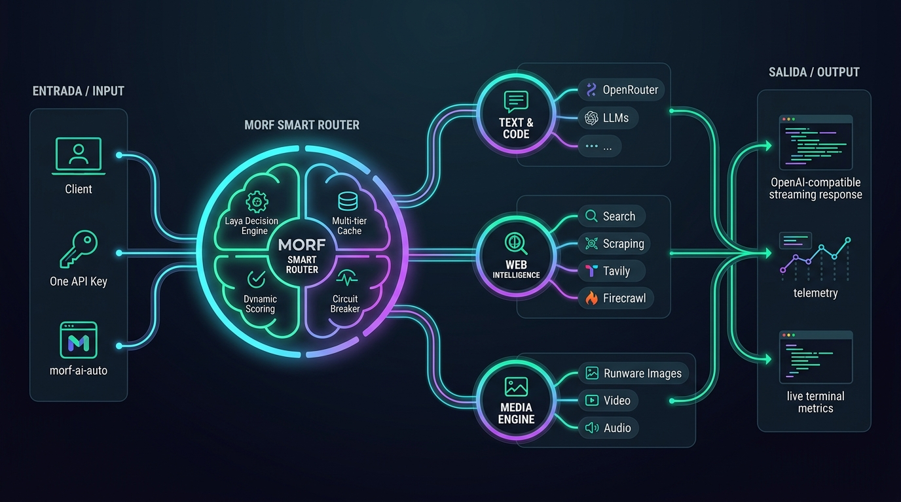

# morf-lite ⚡

> **Módulo cliente ultra-ligero y sin dependencias para Morf AI Smart Gateway & Auto-Router.**  
> Compatible con Node.js (18+), Bun, Deno, Cloudflare Workers, Next.js y navegadores modernos.

[](https://opensource.org/licenses/MIT)
[](https://www.typescriptlang.org/)
[]()



---

> 📖 **Arquitectura & Visión:** Para conocer la especificación de infraestructura completa, integración con Laya, OpenRouter, Runware, Firecrawl, Tavily, Exa y las 20 fases de desarrollo, consulta el documento maestro: [**ROADMAP & ESPECIFICACIÓN DE ARQUITECTURA**](ROADMAP.md).

---

## 🚀 Características

- **Cero dependencias externas:** Utiliza `fetch` nativo y estándares web de streaming.
- **Compatible con OpenAI API:** Formato estándar `chat.completions.create` con soporte completo de streaming y no-streaming.
- **Auto-Enrutador Inteligente (`morf-ai-auto`):** Enrutamiento dinámico y determinista sin coste de tokens clasificadores.
- **Gestión de Contexto Multi-Turno (`MorfSession`):** Clase lista para retener la memoria de la conversación turno a turno sin perder contexto al cambiar de modelo o proveedor.
- **Streaming en tiempo real:** Lectura nativa de Server-Sent Events (SSE) con `for await (const chunk of stream)`.
- **Seguro y desacoplado:** Sin credenciales fijas en el código; configurable por parámetros o variables de entorno.

---

## 📦 Instalación

Puedes instalarlo directamente desde GitHub en cualquier proyecto:

```bash
npm install github:CodeMorf/morf-lite
```

O si utilizas yarn / pnpm / bun:

```bash
pnpm add github:CodeMorf/morf-lite
# o
bun add github:CodeMorf/morf-lite
```

---

## ⚙️ Configuración y Variables de Entorno

El cliente no requiere ninguna clave forzada en el código. Lee automáticamente las siguientes variables de entorno si están disponibles:

| Variable | Descripción | Valor por defecto |
| :--- | :--- | :--- |
| `MORF_API_KEY` | Clave API de Morf AI (Master key o clave de cliente) | `""` |
| `MORF_BASE_URL` | URL base del Gateway o proxy | `https://morf.codes/api/morf` |

O puedes pasarlas directamente en el constructor:

```typescript
import { MorfClient } from 'morf-lite';

const client = new MorfClient({
  baseUrl: 'https://morf.codes/api/morf', // o tu proxy local
  apiKey: process.env.MI_VARIABLE_SECRETA,
  timeout: 60000, // 60 segundos
});
```

---

## 💡 Ejemplos de Uso

### 1. Inferencia Básica (Completions)

```typescript
import { MorfClient } from 'morf-lite';

const client = new MorfClient();

async function main() {
  const response = await client.chat.completions.create({
    model: 'morf-ai-auto', // Auto-enrutador de Morf
    messages: [
      { role: 'system', content: 'Eres un asistente técnico conciso.' },
      { role: 'user', content: 'Explica en 2 líneas qué es un proxy inverso.' }
    ],
    temperature: 0.7,
  });

  console.log(response.choices[0].message.content);

  // Metadatos devueltos por el Gateway
  if (response._morf) {
    console.log(`Despachado por: ${response._morf.provider} (${response._morf.category})`);
  }
}

main();
```

---

### 2. Streaming en Tiempo Real (SSE)

```typescript
import { MorfClient } from 'morf-lite';

const client = new MorfClient();

async function streamReply() {
  const stream = await client.chat.completions.create({
    model: 'morf-ai-auto',
    messages: [{ role: 'user', content: 'Escribe un poema sobre programación.' }],
    stream: true,
  });

  for await (const chunk of stream) {
    const delta = chunk.choices[0]?.delta?.content || '';
    process.stdout.write(delta);
  }
}

streamReply();
```

---

### 3. Conversación Multi-Turno con Memoria (`MorfSession`)

Conserva todo el contexto de la conversación turno a turno de manera automática:

```typescript
import { MorfClient } from 'morf-lite';

const client = new MorfClient();

async function chat() {
  const session = client.chat.createSession({
    model: 'morf-ai-auto',
    systemPrompt: 'Eres un tutor amigable de JavaScript.',
  });

  // Turno 1
  const r1 = await session.sendMessage('Hola, me llamo Carlos y estoy aprendiendo Promises.');
  console.log('Asistente:', r1.content);

  // Turno 2 (Recuerda el nombre y tema automáticamente)
  const r2 = await session.sendMessage('¿Cuál fue el nombre que te di y qué tema estudio?');
  console.log('Asistente:', r2.content);

  // Ver historial completo acumulado
  console.log(session.getHistory());
}

chat();
```

---

### 4. Consultar Modelos y Estadísticas del Gateway

```typescript
import { MorfClient } from 'morf-lite';

const client = new MorfClient();

// Listar el catálogo disponible (la cantidad cambia con la sincronización)
const models = await client.models.list();
console.log('Modelos disponibles:', models.data.map(m => m.id));

// Consultar métricas de ahorro y peticiones procesadas
const stats = await client.stats();
console.log(`Peticiones: ${stats.stats.requests} | Ahorro: $${stats.stats.saved}`);
```

---

## Memoria persistente y formatos de API

El gateway acepta Chat Completions, Responses y Messages en la misma base
`https://morf.codes/api/morf`. Los tres formatos comparten la memoria del proyecto
asociado a la clave. Para una conversación independiente envía
`morf: { conversation_id: 'mi-conversacion', memory: { scope: 'conversation' } }`.
La memoria persiste hasta que el cliente la borra con `client.memory.delete(...)`.
`MorfSession` conserva su historial en el proceso del cliente; es independiente
de esta memoria del servidor. No se guarda el contenido para entrenar modelos.

El límite anunciado es 60 000 tokens de contexto, sujeto al presupuesto de entrada
del gateway y al modelo disponible. Responses exige reenviar los mensajes y los
resultados de herramientas; `previous_response_id` no sustituye ese historial.

## Agentes, herramientas reales y CLIs

Los trabajos de `client.runs` usan hasta cuatro agentes. Las tareas sin dependencia
corren en paralelo; implementación y revisión esperan los resultados que necesitan.
El servidor publica eventos y solicita herramientas a un ejecutor del cliente.
El directorio de trabajo pertenece a ese ejecutor: el gateway no ejecuta un shell
del cliente en el servidor.

```javascript
const { MorfClient, createCliExecutor } = require('morf-lite');
const apiKey = process.env.MORF_API_KEY;
const client = new MorfClient({ apiKey, timeout: 180000 });
const worker = createCliExecutor({
  apiKey,
  workingDirectory: '/ruta/absoluta/mi-proyecto',
  executables: { grok: '/ruta/absoluta/grok', claude: '/ruta/absoluta/claude' },
  allowWrite: false,
  timeoutMs: 120000,
});
const run = await client.runs.create({
  model: 'morf-ai-auto',
  messages: [{ role: 'user', content: 'Revisa un archivo concreto del proyecto. Usa run_cli y pasa los hallazgos a revisión.' }],
  max_agents: 4,
  morf: { executor: worker.executor, conversation_id: 'revision-1' },
});
await client.runs.work(run.run_id, worker.execute, event => {
  console.log(event.type, event.agent_id || '', event.status || '');
});
```

El adaptador admite ejecutables instalados de Grok, Codex, Claude Code y OpenCode.
No los instala ni crea permisos de escritura por su cuenta. Las opciones y los
límites del CLI pueden variar según la versión instalada. Un resultado fallido,
vacío o que supera el plazo se entrega al agente como un error real.

Para Doable configura un proveedor personalizado con esa base, una clave con
nombre y `morf-ai-auto`. Mantén las herramientas de proyecto en Doable y devuelve
sus resultados al gateway. La compatibilidad de protocolo no certifica por sí sola
la edición, el build y el preview de una instalación de Doable.

## Capacidades y control del gasto

`client.capabilities.list()` enumera búsqueda web, extracción de páginas, imagen
y vídeo. `execute(name, arguments)` ejecuta la capacidad real. La generación
reserva saldo y liquida el consumo reportado, con `max_cost_usd` como límite del
cliente. Los trabajos de vídeo devuelven un `job_id`; consulta su `poll_url` sin
crear otro trabajo. Para audio y vídeo automático usa un `request_id` estable.
Si falta saldo operativo en un servicio, el error debe resolverse en su cuenta.

La política automática busca un 80% de tokens de programación en las rutas base
y limita el uso premium al 10% del consumo ya medido. El caché depende del modelo,
del prefijo repetido y de los tokens de caché reportados; no garantiza un 90% de
ahorro sobre todo el gasto.

## 🛠️ Desarrollo y Compilación Local

```bash
# Instalar dependencias de desarrollo (TypeScript)
npm install

# Compilar CommonJS y ESM
npm run build

# Ejecutar pruebas unitarias
npm test
```

---

## 📄 Licencia

MIT © [CodeMorf](https://morf.codes)
